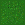

RoboArena Report

As a part of a univerity project we created a game called RoboArena.

Game start:

To start the game the player needs to press any key on the keyboard.

Gameplay:
The player controls his Robot with the WASD keys and is able to shoot a bullet with the space bar. 
The player robot also 3 heart wich represent the lives to robot has.
On the map are several enemies wich can be shoot with the bullet. The enemies are can shoot bullets themself wich take a life from the player robot if it hits him.
The enemies are dying after one hit from the player and right after another one spawns again.

Arena:
The map consist of different tiles
The grass-tile:

 
img[alt=image] { width: 200px; }

