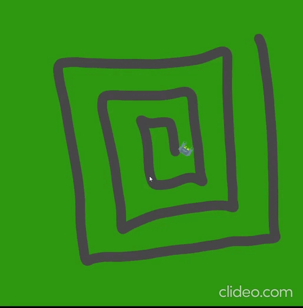

RoboArena Report

As a part of a univerity project we created a game called RoboArena.

Game start:

To start the game the player needs to press any key on the keyboard.

Gameplay:

The player controls his Robot with the WASD keys and is able to shoot a bullet with the space bar. 
The player robot also 3 heart wich represent the lives to robot has.
On the map are several enemies wich can be shoot with the bullet. The enemies are can shoot bullets themself wich take a life from the player robot if it hits him.
The enemies are dying after one hit from the player and right after another one spawns again.

Arena:

The map consist of different tiles

The grass-tile: Robots can walk normally on them.

The sand-tiles: Robots walk slowly on them.

The wall-tiles: Robots can't walk through them and bounce back.

The water-tiles: Robots can't walk through them.

The electric-tiles: If the robot walked completly on that tile they can't walk for a bit.

Enemies:

There are two tipes of enemies. 
At the game start there are 3 enemies who are following a specific path and are respawned at their starting position.
The other two are following the player robot and are respawned near the player robot.

Victory:

To win this game the player need do shoot 10 enemy robots down. With each hit the score increases by one. If the score is eaqual to 10 the word victoy will show up on the screen. To return to the start screen the player needs to press any key and play again he needs to press any key again.

Game over:

Every time the player robot gets hit by a bullet from an enemy or collides with an enemy the player looses a heart.
If he gets hit 3 times no heart is left and the game over screen shows up.
To return to the start screen the player needs to press any key and play again he needs to press any key again.

UML:

First days of coding:

Coding the movement of the player and first background

