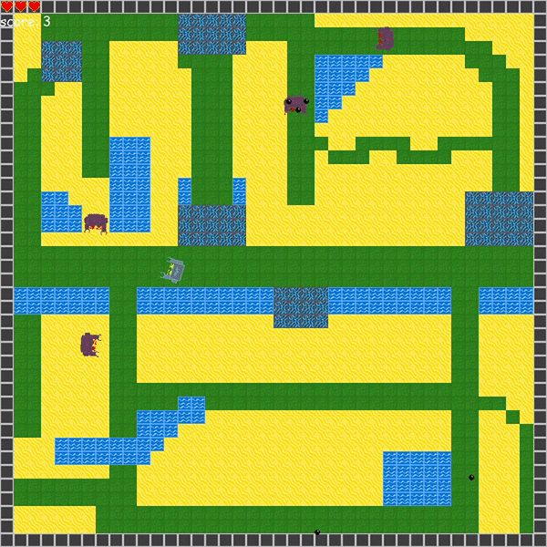

## RoboArena Report

As a part of a university project, we created a game called RoboArena.

- <a href="#gamestart"> Game start </a>
- <a href="gameplay"> Gameplay </a>
- <a href="arena"> Arena </a>
- <a href="enemies"> Enemies </a>
- <a href="gamestates"> Game states </a>
- <a href="uml"> UML & Sequenze </a>
- <a href="time"> With more time </a>

<h4 id="gamestart"> Game start: </h4>

To start the game the player needs to press any key on the keyboard.

<h4 id="gameplay"> Gameplay: </h4>

The player controls his Robot with the WASD keys and is able to shoot a bullet with the space bar.  
The player robot also 3 hearts which represent the lives to robot has. 
On the map are several enemies which can be shot with a bullet. The enemies are can shoot bullets themself which takes a life from the player robot if it hits him. 
The enemies are dying after one hit from the player and right after another one spawns again.

<h4 id="arena"> Arena: </h4>

The map consists of different tiles:

The grass tile: Robots can walk normally on them.

The sand tiles: Robots walk slowly on them.

The wall tiles: Robots can't walk through them and bounce back. IBullets dissapear if they hit a wall tile

The water tiles: Robots can't walk through them.

The electric tiles: If the robot walked completely on that tile the robot can't walk for a while.

#### Creation of the Arena:

To create the map for the arena we used a csv file.  
For the csv file, every tile gets its number. The number in the csv file can easily get changed if we wanted to change the map.

#### Enemies:

There are two types of enemies. 
At the game start, there are 3 enemies who are following a specific path and are respawned at their starting position. 
The other two are following the player robot and are respawned near the player robot.

<h4 id="gamestates"> Game states: </h4>
##### Victory:

To win this game the player needs to shoot 10 enemy robots down. With each hit, the score increases by one. If the score is equal to 10 the word victory will show up on the screen.  
To return to the start screen the player needs to press any key and play again he needs to press any key again.

##### Game over:

Every time the player robot gets hit by a bullet from an enemy or collides with an enemy the player loses a heart. If he gets hit 3 times no heart is left and the game over screen shows up. 
To return to the start screen the player needs to press any key and play again he needs to press any key again.

##### Game paused:

If the player presses the key p the game pauses. With any other key, the game continues again.

<h4 id="uml"> UML: </h4>

#### Sequenz:

#### First days of coding:

Coding the movement of the player and the first background

<h4 id="time"> With more time: </h4>

One suggestion we got was to implement more maps for the game.
We also wanted to do that for a better game experience but we finished the game how it is now on Tuesday. If we were free the last to days we might be able to integrate other maps on time. Not only the coding would have taken too much time but also the enemies. The enemies are following a path containing the coordinates of the points the enemies are following. The points are found out per hand. We tried to create a function so that you only need to click with the mouse on the field where you want the enemy to walk around. That didn't work well because the enemy will still get stuck on the water or wall.

